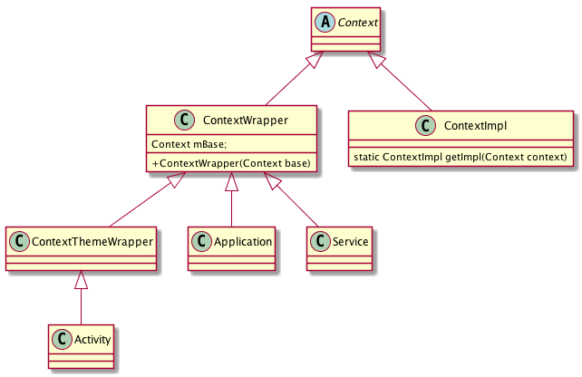

## 什么是Context。

Context的意思是上下文或者情景。在安卓开发中到处到处都会用到Context。Activity、Service、Application的父类。

## Context类的功能和主要方法

### 四大组件相关

* ContentResolver getContentResolver();

### 获取资源
* AssetManager getAssets();
* Resources getResources();
* final CharSequence getText(@StringRes int resId)
* final String getString(@StringRes int resId)
* final int getColor(@ColorRes int id)
* final Drawable getDrawable(@DrawableRes int id)
* final ColorStateList getColorStateList(@ColorRes int id)

### 
* public abstract void setTheme(@StyleRes int resid);
*  public int getThemeResId()
*  public abstract Resources.Theme getTheme();
### 其他

 * public abstract PackageManager getPackageManager();
 * public abstract Looper getMainLooper();
 * public abstract Context getApplicationContext();

## Context的类图

## Context类

### 一个App中可以有几个Context 实例。

Activity+Service+1

## 参考

* [Context文档](https://developer.android.com/reference/android/content/Context.html)
* [从源码角度看各种Context](http://navyblue.top/2017/08/13/%E4%BB%8E%E6%BA%90%E7%A0%81%E8%A7%92%E5%BA%A6%E7%9C%8B%E5%90%84%E7%A7%8DContext/)
* [详细了解Context](http://www.woaitqs.cc/android/2016/09/07/android-context-implemention.html)
* [\[译\]探索Context之Context是什么](http://www.jianshu.com/p/c29bf9efcfc1)
* [Android Context完全解析，你所不知道的Context的各种细节](http://blog.csdn.net/guolin_blog/article/details/47028975)
* [Android深入理解Context（一）Context关联类和Application Context创建过程](http://liuwangshu.cn/framework/context/1-application-context.html)
* [Android深入理解Context（二）Activity和Service的Context创建过程](http://liuwangshu.cn/framework/context/2-activity-service.html)
* [记一次 View.getContext() 遇到的大坑](https://juejin.im/post/5934f9070ce4630057260c7c)
* [Android的Context泄露分析和解决方案](https://my.oschina.net/u/3026396/blog/856967)
* [Android插件化基础2----理解Context](http://www.jianshu.com/p/e6ce2d03f8f9)

