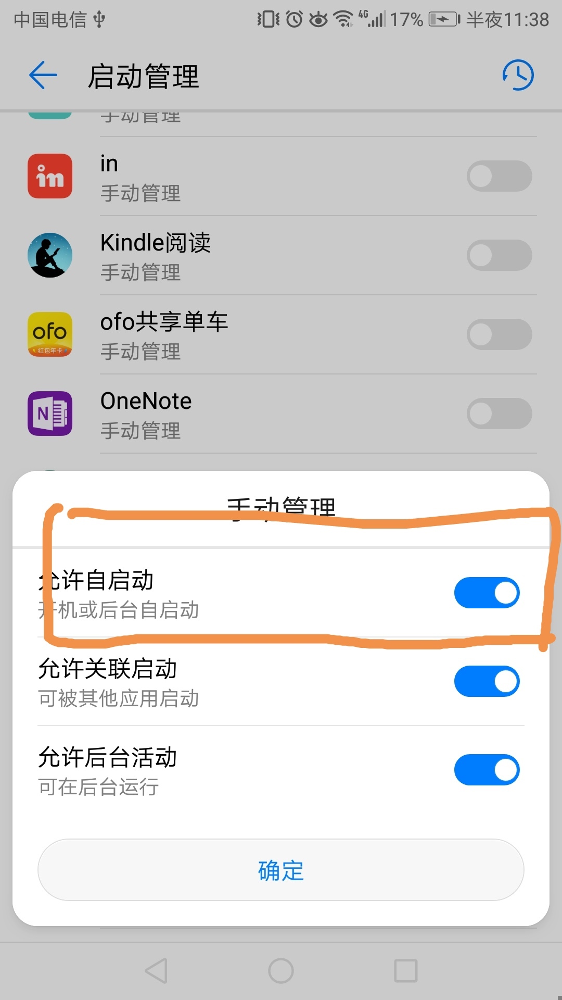

# App开机自启动

## 通过开机广播来实现自启动

* 定义开机广播

```
public class BootCompletedReceiver extends BroadcastReceiver {

	@Override
	public void onReceive(Context context, Intent intent) {
		if(intent.getAction() == Intent.ACTION_BOOT_COMPLETED){
			//在这里定义后续的处理，比如启动Activity和Service
		}
	}
}
```

* 在`AndroidManifest.xml`注册`BootCompletedReceiver`


```
 <uses-permission android:name="android.permission.RECEIVE_BOOT_COMPLETED" />
 <receiver android:name=".test.receiver.BootCompletedReceiver"
            android:permission="android.permission.RECEIVE_BOOT_COMPLETED">
    <intent-filter>
        <action android:name="android.intent.action.BOOT_COMPLETED" />
    </intent-filter>
</receiver>
```

## APP自启动失败.

APP在安卓系统5.0以前一般都是可以自启动成功的.安卓5.0以后国内的手机厂商做了限制,只有设置了开机自启动权限以后,才可以开机自启动. 下面是EMUI8.0系统的设置开机自启动的方法




## 参考

* [Android应用如何开机自启动、自启动失败原因](http://www.trinea.cn/android/android-boot_completed-not-work/)

