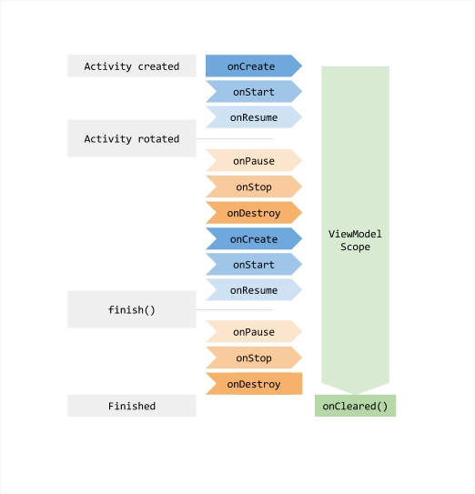

# ViewModel

## 什么是ViewModel

ViewModel主要用于在Activity/Fragment被自动销毁时保存的一些数据,从实现原理上讲,主要就是利用fragment的setRetainInstance(true). 

ViewModel重心在于对数据状态的维护.
提供了下面的功能

* 配置更改期间自动保留数据-比如横竖屏旋转.
* Activity和FragmentUI组件之间的通信.

google建议ViewModel尽量保证纯业务代码,不要持有任何View、Activity、Fragment、Lifecycle的引用. 

当横竖屏旋转后,Activity被重新创建了,它会收到被之前相同的ViewModel实例,当所属的Activity终止后,框架调用ViewModel的onCleard()方法释放对应的资源.


ViewModel在对应的作用域内保持生命周期内的局部单例.

更方便的UI组件之间的通信.
如果ViewModel实例化作用域为Activity的生命周期, 则两个Fragment可以持有同一个ViewModel的实例, 意味着数据状态的共享.

ViewModel层的根本职责,就是负责维护UI的状态, 追根究底就是维护对应的数据.




## 主要涉及的类

* ViewModel
* AndroidViewModel
* ViewModelProvider
* ViewModelStore: 
    
    存储ViewModel的实例.
* HolderFragment: 
    
    调用setRetainInstance(true)方法的Fragment, ViewModeStore实例存储在这里.

## ViewModel

ViewModel是一个 类,至定义了一个空方法:onCleared(),当对应的Model实例被销毁时,onCleared()将会执行.

```java
public abstract class ViewModel {
    /**
     * This method will be called when this ViewModel is no longer used and will be destroyed.
     * <p>
     * It is useful when ViewModel observes some data and you need to clear this subscription to
     * prevent a leak of this ViewModel.
     */
    @SuppressWarnings("WeakerAccess")
    protected void onCleared() {
    }
}
```

## AndroidViewModel


```java

public class AndroidViewModel extends ViewModel {
    @SuppressLint("StaticFieldLeak")
    private Application mApplication;

    public AndroidViewModel(@NonNull Application application) {
        mApplication = application;
    }

    /**
     * Return the application.
     */
    @SuppressWarnings("TypeParameterUnusedInFormals")
    @NonNull
    public <T extends Application> T getApplication() {
        //noinspection unchecked
        return (T) mApplication;
    }
}
```

##  ViewModelProviders

ViewModelProviders可以看成是viewModelProvider的工厂或相关工具类的合集.

```java
package androidx.lifecycle;

import android.app.Activity;
import android.app.Application;

import androidx.annotation.MainThread;
import androidx.annotation.NonNull;
import androidx.annotation.Nullable;
import androidx.fragment.app.Fragment;
import androidx.fragment.app.FragmentActivity;
import androidx.lifecycle.ViewModelProvider.Factory;

/**
 * Utilities methods for {@link ViewModelStore} class.
 */
public class ViewModelProviders {

    /**
     * @deprecated This class should not be directly instantiated
     */
    @Deprecated
    public ViewModelProviders() {
    }

    private static Application checkApplication(Activity activity) {
        Application application = activity.getApplication();
        if (application == null) {
            throw new IllegalStateException("Your activity/fragment is not yet attached to "
                    + "Application. You can't request ViewModel before onCreate call.");
        }
        return application;
    }

    private static Activity checkActivity(Fragment fragment) {
        Activity activity = fragment.getActivity();
        if (activity == null) {
            throw new IllegalStateException("Can't create ViewModelProvider for detached fragment");
        }
        return activity;
    }

    /**
     * Creates a {@link ViewModelProvider}, which retains ViewModels while a scope of given
     * {@code fragment} is alive. More detailed explanation is in {@link ViewModel}.
     * <p>
     * It uses {@link ViewModelProvider.AndroidViewModelFactory} to instantiate new ViewModels.
     *
     * @param fragment a fragment, in whose scope ViewModels should be retained
     * @return a ViewModelProvider instance
     */
    @NonNull
    @MainThread
    public static ViewModelProvider of(@NonNull Fragment fragment) {
        return of(fragment, null);
    }

    /**
     * Creates a {@link ViewModelProvider}, which retains ViewModels while a scope of given Activity
     * is alive. More detailed explanation is in {@link ViewModel}.
     * <p>
     * It uses {@link ViewModelProvider.AndroidViewModelFactory} to instantiate new ViewModels.
     *
     * @param activity an activity, in whose scope ViewModels should be retained
     * @return a ViewModelProvider instance
     */
    @NonNull
    @MainThread
    public static ViewModelProvider of(@NonNull FragmentActivity activity) {
        return of(activity, null);
    }

    /**
     * Creates a {@link ViewModelProvider}, which retains ViewModels while a scope of given
     * {@code fragment} is alive. More detailed explanation is in {@link ViewModel}.
     * <p>
     * It uses the given {@link Factory} to instantiate new ViewModels.
     *
     * @param fragment a fragment, in whose scope ViewModels should be retained
     * @param factory  a {@code Factory} to instantiate new ViewModels
     * @return a ViewModelProvider instance
     */
    @NonNull
    @MainThread
    public static ViewModelProvider of(@NonNull Fragment fragment, @Nullable Factory factory) {
        Application application = checkApplication(checkActivity(fragment));
        if (factory == null) {
            factory = ViewModelProvider.AndroidViewModelFactory.getInstance(application);
        }
        return new ViewModelProvider(fragment.getViewModelStore(), factory);
    }

    /**
     * Creates a {@link ViewModelProvider}, which retains ViewModels while a scope of given Activity
     * is alive. More detailed explanation is in {@link ViewModel}.
     * <p>
     * It uses the given {@link Factory} to instantiate new ViewModels.
     *
     * @param activity an activity, in whose scope ViewModels should be retained
     * @param factory  a {@code Factory} to instantiate new ViewModels
     * @return a ViewModelProvider instance
     */
    @NonNull
    @MainThread
    public static ViewModelProvider of(@NonNull FragmentActivity activity,
            @Nullable Factory factory) {
        Application application = checkApplication(activity);
        if (factory == null) {
            factory = ViewModelProvider.AndroidViewModelFactory.getInstance(application);
        }
        return new ViewModelProvider(activity.getViewModelStore(), factory);
    }

    /**
     * {@link Factory} which may create {@link AndroidViewModel} and
     * {@link ViewModel}, which have an empty constructor.
     *
     * 一个创建Model的实例工厂的默认实现.
     * @deprecated Use {@link ViewModelProvider.AndroidViewModelFactory}
     */
    @SuppressWarnings("WeakerAccess")
    @Deprecated
    public static class DefaultFactory extends ViewModelProvider.AndroidViewModelFactory {
        /**
         * Creates a {@code AndroidViewModelFactory}
         *
         * @param application an application to pass in {@link AndroidViewModel}
         * @deprecated Use {@link ViewModelProvider.AndroidViewModelFactory} or
         * {@link ViewModelProvider.AndroidViewModelFactory#getInstance(Application)}.
         */
        @Deprecated
        public DefaultFactory(@NonNull Application application) {
            super(application);
        }
    }
}


```


## ViewProvider


```java
package android.arch.lifecycle;

import android.support.annotation.MainThread;
import android.support.annotation.NonNull;

/**
 */
@SuppressWarnings("WeakerAccess")
public class ViewModelProvider {

    private static final String DEFAULT_KEY =
            "android.arch.lifecycle.ViewModelProvider.DefaultKey";

    /**
     * 创建Model的实例工厂.
     */
    public interface Factory {
        /**
         * Creates a new instance of the given {@code Class}.
         * <p>
         *
         * @param modelClass a {@code Class} whose instance is requested
         * @param <T>        The type parameter for the ViewModel.
         * @return a newly created ViewModel
         */
        @NonNull
        <T extends ViewModel> T create(@NonNull Class<T> modelClass);
    }

    private final Factory mFactory;
    private final ViewModelStore mViewModelStore;

    /**
     * Creates {@code ViewModelProvider}, which will create {@code ViewModels} via the given
     * {@code Factory} and retain them in a store of the given {@code ViewModelStoreOwner}.
     *
     * @param owner   a {@code ViewModelStoreOwner} whose {@link ViewModelStore} will be used to
     *                retain {@code ViewModels}
     * @param factory a {@code Factory} which will be used to instantiate
     *                new {@code ViewModels}
     */
    public ViewModelProvider(@NonNull ViewModelStoreOwner owner, @NonNull Factory factory) {
        this(owner.getViewModelStore(), factory);
    }

    /**
     * Creates {@code ViewModelProvider}, which will create {@code ViewModels} via the given
     * {@code Factory} and retain them in the given {@code store}.
     *
     * @param store   {@code ViewModelStore} where ViewModels will be stored.
     * @param factory factory a {@code Factory} which will be used to instantiate
     *                new {@code ViewModels}
     */
    public ViewModelProvider(@NonNull ViewModelStore store, @NonNull Factory factory) {
        mFactory = factory;
        this.mViewModelStore = store;
    }

    /**
     * Returns an existing ViewModel or creates a new one in the scope (usually, a fragment or
     * an activity), associated with this {@code ViewModelProvider}.
     * <p>
     * The created ViewModel is associated with the given scope and will be retained
     * as long as the scope is alive (e.g. if it is an activity, until it is
     * finished or process is killed).
     *
     * @param modelClass The class of the ViewModel to create an instance of it if it is not
     *                   present.
     * @param <T>        The type parameter for the ViewModel.
     * @return A ViewModel that is an instance of the given type {@code T}.
     */
    @NonNull
    public <T extends ViewModel> T get(@NonNull Class<T> modelClass) {
        String canonicalName = modelClass.getCanonicalName();
        if (canonicalName == null) {
            throw new IllegalArgumentException("Local and anonymous classes can not be ViewModels");
        }
        return get(DEFAULT_KEY + ":" + canonicalName, modelClass);
    }

    /**
     * Returns an existing ViewModel or creates a new one in the scope (usually, a fragment or
     * an activity), associated with this {@code ViewModelProvider}.
     * <p>
     * The created ViewModel is associated with the given scope and will be retained
     * as long as the scope is alive (e.g. if it is an activity, until it is
     * finished or process is killed).
     *
     * @param key        The key to use to identify the ViewModel.
     * @param modelClass The class of the ViewModel to create an instance of it if it is not
     *                   present.
     * @param <T>        The type parameter for the ViewModel.
     * @return A ViewModel that is an instance of the given type {@code T}.
     */
    @NonNull
    @MainThread
    public <T extends ViewModel> T get(@NonNull String key, @NonNull Class<T> modelClass) {
        ViewModel viewModel = mViewModelStore.get(key);

        if (modelClass.isInstance(viewModel)) {
            //noinspection unchecked
            return (T) viewModel;
        } else {
            //noinspection StatementWithEmptyBody
            if (viewModel != null) {
                // TODO: log a warning.
            }
        }

        viewModel = mFactory.create(modelClass);
        mViewModelStore.put(key, viewModel);
        //noinspection unchecked
        return (T) viewModel;
    }

    /**
     * Simple factory, which calls empty constructor on the give class.
     * 创建Model的实例工厂.
     */
    public static class NewInstanceFactory implements Factory {

        @NonNull
        @Override
        public <T extends ViewModel> T create(@NonNull Class<T> modelClass) {
            //noinspection TryWithIdenticalCatches
            try {
                return modelClass.newInstance();
            } catch (InstantiationException e) {
                throw new RuntimeException("Cannot create an instance of " + modelClass, e);
            } catch (IllegalAccessException e) {
                throw new RuntimeException("Cannot create an instance of " + modelClass, e);
            }
        }
    }
}

```


## ViewModelStore


```java
package android.arch.lifecycle;

import java.util.HashMap;

/**
 * 所有的方法和变量都是final类型, 不允许修改.
 */
public class ViewModelStore {

    private final HashMap<String, ViewModel> mMap = new HashMap<>();

    /**
    * 缓存ViewModel,如果已经存在先调用onCleared,然后在释放.
    */
    final void put(String key, ViewModel viewModel) {
        ViewModel oldViewModel = mMap.get(key);
        if (oldViewModel != null) {
            oldViewModel.onCleared();
        }
        mMap.put(key, viewModel);
    }

    final ViewModel get(String key) {
        return mMap.get(key);
    }

    /**
     *  Clears internal storage and notifies ViewModels that they are no longer used.
     */
    public final void clear() {
        for (ViewModel vm : mMap.values()) {
            vm.onCleared();
        }
        mMap.clear();
    }
}
```


## ViewModelStores


```java

/*
 * Copyright (C) 2017 The Android Open Source Project
 *
 * Licensed under the Apache License, Version 2.0 (the "License");
 * you may not use this file except in compliance with the License.
 * You may obtain a copy of the License at
 *
 *      http://www.apache.org/licenses/LICENSE-2.0
 *
 * Unless required by applicable law or agreed to in writing, software
 * distributed under the License is distributed on an "AS IS" BASIS,
 * WITHOUT WARRANTIES OR CONDITIONS OF ANY KIND, either express or implied.
 * See the License for the specific language governing permissions and
 * limitations under the License.
 */

package android.arch.lifecycle;

import static android.arch.lifecycle.HolderFragment.holderFragmentFor;

import android.support.annotation.MainThread;
import android.support.annotation.NonNull;
import android.support.v4.app.Fragment;
import android.support.v4.app.FragmentActivity;

/**
 * Factory methods for {@link ViewModelStore} class.
 */
@SuppressWarnings("WeakerAccess")
public class ViewModelStores {

    private ViewModelStores() {
    }

    /**
     * 
     */
    @MainThread
    public static ViewModelStore of(@NonNull FragmentActivity activity) {
        return holderFragmentFor(activity).getViewModelStore();
    }

    /**
     *
     */
    @MainThread
    public static ViewModelStore of(@NonNull Fragment fragment) {
        return holderFragmentFor(fragment).getViewModelStore();
    }
}

```


## HolderFragment


```java
/*
 * 一个用户不可见的Fragment, 调用setRetainInstance(true)方法,并持有ViewModel,这样当Activity因为屏幕的选择销毁并重建时,该Fragment存储的ViewModel自然不会随之销毁回收了.
 */

package android.arch.lifecycle;

import android.app.Activity;
import android.app.Application.ActivityLifecycleCallbacks;
import android.os.Bundle;
import android.support.annotation.Nullable;
import android.support.annotation.RestrictTo;
import android.support.v4.app.Fragment;
import android.support.v4.app.FragmentActivity;
import android.support.v4.app.FragmentManager;
import android.support.v4.app.FragmentManager.FragmentLifecycleCallbacks;
import android.util.Log;

import java.util.HashMap;
import java.util.Map;

/**
 * @hide
 */
@RestrictTo(RestrictTo.Scope.LIBRARY_GROUP)
public class HolderFragment extends Fragment {
    private static final String LOG_TAG = "ViewModelStores";

    private static final HolderFragmentManager sHolderFragmentManager = new HolderFragmentManager();

    /**
     * @hide
     */
    @RestrictTo(RestrictTo.Scope.LIBRARY_GROUP)
    public static final String HOLDER_TAG =
            "android.arch.lifecycle.state.StateProviderHolderFragment";


    // 存储ViewModel
    private ViewModelStore mViewModelStore = new ViewModelStore();

    public HolderFragment() {
        //使当前的Fragment在Activity重建时存活下来.
        setRetainInstance(true);
    }

    @Override
    public void onCreate(@Nullable Bundle savedInstanceState) {
        super.onCreate(savedInstanceState);
        sHolderFragmentManager.holderFragmentCreated(this);
    }

    @Override
    public void onSaveInstanceState(Bundle outState) {
        super.onSaveInstanceState(outState);
    }

    @Override
    public void onDestroy() {
        super.onDestroy();
        //销毁时调用ViewModel的方法,释放资源.
        mViewModelStore.clear();
    }

    public ViewModelStore getViewModelStore() {
        return mViewModelStore;
    }

    /**
     * @hide
     */
    @RestrictTo(RestrictTo.Scope.LIBRARY_GROUP)
    public static HolderFragment holderFragmentFor(FragmentActivity activity) {
        return sHolderFragmentManager.holderFragmentFor(activity);
    }

    /**
     * @hide
     */
    @RestrictTo(RestrictTo.Scope.LIBRARY_GROUP)
    public static HolderFragment holderFragmentFor(Fragment fragment) {
        return sHolderFragmentManager.holderFragmentFor(fragment);
    }

    @SuppressWarnings("WeakerAccess")
    static class HolderFragmentManager {
        private Map<Activity, HolderFragment> mNotCommittedActivityHolders = new HashMap<>();
        private Map<Fragment, HolderFragment> mNotCommittedFragmentHolders = new HashMap<>();

        private ActivityLifecycleCallbacks mActivityCallbacks =
                new EmptyActivityLifecycleCallbacks() {
                    @Override
                    public void onActivityDestroyed(Activity activity) {
                        HolderFragment fragment = mNotCommittedActivityHolders.remove(activity);
                        if (fragment != null) {
                            Log.e(LOG_TAG, "Failed to save a ViewModel for " + activity);
                        }
                    }
                };

        private boolean mActivityCallbacksIsAdded = false;

        private FragmentLifecycleCallbacks mParentDestroyedCallback =
                new FragmentLifecycleCallbacks() {
                    @Override
                    public void onFragmentDestroyed(FragmentManager fm, Fragment parentFragment) {
                        super.onFragmentDestroyed(fm, parentFragment);
                        HolderFragment fragment = mNotCommittedFragmentHolders.remove(
                                parentFragment);
                        if (fragment != null) {
                            Log.e(LOG_TAG, "Failed to save a ViewModel for " + parentFragment);
                        }
                    }
                };

        void holderFragmentCreated(Fragment holderFragment) {
            Fragment parentFragment = holderFragment.getParentFragment();
            if (parentFragment != null) {
                mNotCommittedFragmentHolders.remove(parentFragment);
                parentFragment.getFragmentManager().unregisterFragmentLifecycleCallbacks(
                        mParentDestroyedCallback);
            } else {
                mNotCommittedActivityHolders.remove(holderFragment.getActivity());
            }
        }

        private static HolderFragment findHolderFragment(FragmentManager manager) {
            if (manager.isDestroyed()) {
                throw new IllegalStateException("Can't access ViewModels from onDestroy");
            }

            Fragment fragmentByTag = manager.findFragmentByTag(HOLDER_TAG);
            if (fragmentByTag != null && !(fragmentByTag instanceof HolderFragment)) {
                throw new IllegalStateException("Unexpected "
                        + "fragment instance was returned by HOLDER_TAG");
            }
            return (HolderFragment) fragmentByTag;
        }

        private static HolderFragment createHolderFragment(FragmentManager fragmentManager) {
            HolderFragment holder = new HolderFragment();
            fragmentManager.beginTransaction().add(holder, HOLDER_TAG).commitAllowingStateLoss();
            return holder;
        }

        HolderFragment holderFragmentFor(FragmentActivity activity) {
            FragmentManager fm = activity.getSupportFragmentManager();
            HolderFragment holder = findHolderFragment(fm);
            if (holder != null) {
                return holder;
            }
            holder = mNotCommittedActivityHolders.get(activity);
            if (holder != null) {
                return holder;
            }

            if (!mActivityCallbacksIsAdded) {
                mActivityCallbacksIsAdded = true;
                activity.getApplication().registerActivityLifecycleCallbacks(mActivityCallbacks);
            }
            holder = createHolderFragment(fm);
            mNotCommittedActivityHolders.put(activity, holder);
            return holder;
        }

        HolderFragment holderFragmentFor(Fragment parentFragment) {
            FragmentManager fm = parentFragment.getChildFragmentManager();
            HolderFragment holder = findHolderFragment(fm);
            if (holder != null) {
                return holder;
            }
            holder = mNotCommittedFragmentHolders.get(parentFragment);
            if (holder != null) {
                return holder;
            }

            parentFragment.getFragmentManager()
                    .registerFragmentLifecycleCallbacks(mParentDestroyedCallback, false);
            holder = createHolderFragment(fm);
            mNotCommittedFragmentHolders.put(parentFragment, holder);
            return holder;
        }
    }
}

```


## ViewModelStoreOwner


```java
package android.arch.lifecycle;
import android.support.annotation.NonNull;
@SuppressWarnings("WeakerAccess")
public interface ViewModelStoreOwner {
    /**
     * 
     */
    @NonNull
    ViewModelStore getViewModelStore();
}

```

