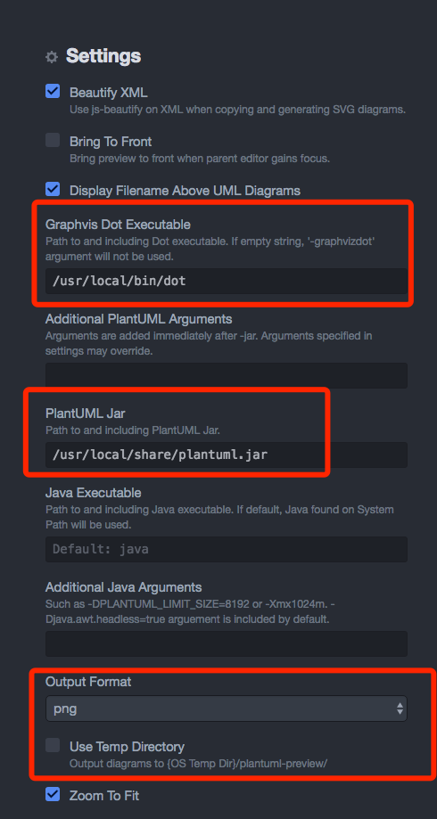
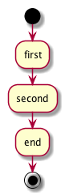

## 在ATOM中使用PlantUML

### PlantUML介绍

  PlantUML 可以用来画类图和流程图，类似MarkDown语法那样简单实用。

### 安装Graphviz

  * mac : brew install graphviz
  * ubuntu : apt-get install graphviz

安装成功后查看dot的路径：


```
$ ~ which dot
  /usr/local/bin/dot
```

### 下载Plantuml.jar
 
 下载 [Plantuml.jar](https://sourceforge.net/projects/plantuml/?source=typ_redirect)

  将Plantuml.jar 移动到/usr/local/share

### 安装插件

  * language-plantuml
  * plantuml-preview

    安装安装完成Plantuml-preview 插件后需要进行设置

    1. 设置Grahvis Dot Executable的路径。
    2. 设置PlantUML Jar的路径。
    3. 设置导出图片的格式和路径。
      默认是SVG格式和USE Temp Directory.我在设置导出为png格式且导出路径为文件所在的目录。

    

### 创建测试文件 test.puml


```
 @startuml
  start
  :first;
  :second;
  :end;
  stop
  @enduml
```

### 查看效果

  ctrl+alt+p 查看预览效果

  

  如果提示 "Cannot find Graphviz",那么安装 Graphviz 后就可以解决这个问题

### 参考

  [PlantUML in ATOM](http://trevershick.github.io/atom/2015/12/04/plantuml-snippets.html)


