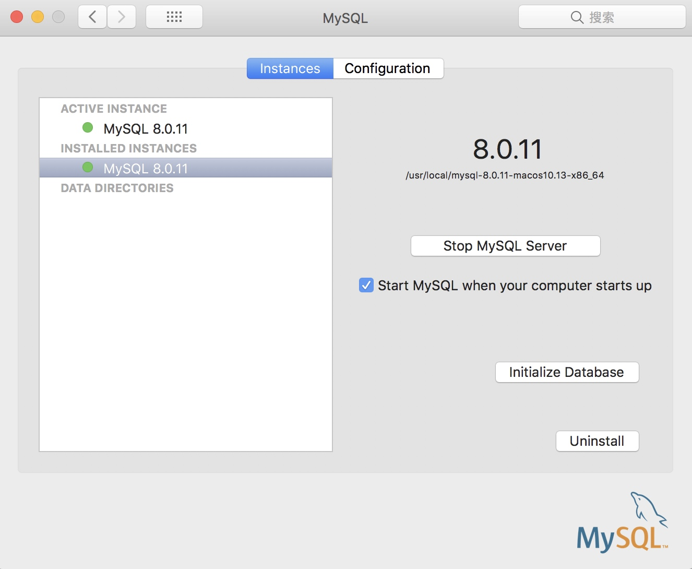

## 安装MySql

* 下载地址[MySql](https://dev.mysql.com/downloads/mysql/)
* 点击dmg文件安装.
* 在系统偏好设置里面开启MySql服务
  

* 配置环境变量 `PATH=$PATH:/usr/local/mysql/bin`

* 登陆Mysql `mysql -uroot -p`
* 重置密码：`SET PASSWORD FOR 'root'@'localhost' = PASSWORD('newpass');`

