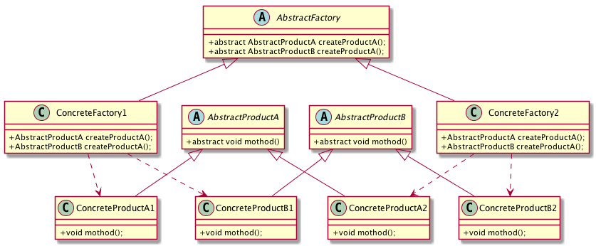

# 抽象工厂模式

## 抽象工厂模式

Provide an interface for creating families of related or dependent objects without specifying their concrete classes.为创建一组相关或相互依赖的对象提供一个接口，而且无需制定它们的具体类。

## 抽象工厂模式的类图 



## 代码参考

```
 /**
* 抽象产品A
*/
public abstract class AbstractProductA{
   public abstract void method();
}

/**
* 抽象产品B
*/
public abstract class AbstractProductB{
   public abstract void method();
}

/**
* 具体产品A1
*/
public class ConcreteProductA1 extends AbstractProductA{

   @Override
   public void method() {
       System.out.println(getClass().getSimpleName()+".method");
   }
}
/**
* 具体产品A2
*/
public class ConcreteProductA2 extends AbstractProductA{

   @Override
   public void method() {
       System.out.println(getClass().getSimpleName()+".method");
   }
}

/**
* 具体产品B1
*/
public class ConcreteProductB1 extends AbstractProductB{

   @Override
   public void method() {
       System.out.println(getClass().getSimpleName()+".method");
   }
}

/**
* 具体产品B2
*/
public class ConcreteProductB2 extends AbstractProductB{

   @Override
   public void method() {
       System.out.println(getClass().getSimpleName()+".method");
   }
}

/**
* 抽象工厂
*/
public abstract class AbstractFactory{
   public abstract AbstractProductA createProductA();
   public abstract AbstractProductB createProductB();
}

/**
* 具体的工厂1
*/
public class ConcreteFactory1 extends AbstractFactory{

   @Override
   public AbstractProductA createProductA() {
       return new ConcreteProductA1();
   }

   @Override
   public AbstractProductB createProductB() {
       return new ConcreteProductB1();
   }
}

/**
* 具体的工厂2
*/
public class ConcreteFactory2 extends AbstractFactory{

   @Override
   public AbstractProductA createProductA() {
       return new ConcreteProductA2();
   }

   @Override
   public AbstractProductB createProductB() {
       return new ConcreteProductB2();
   }
}

public static void main(String[] args){
  AbstractFactory factory1 = new ConcreteFactory1();
   factory1.createProductA().method();
   factory1.createProductB().method();

   AbstractFactory factory2 = new ConcreteFactory2();
   factory2.createProductA().method();
   factory2.createProductB().method();
}
```

## 抽象工厂的角色

* AbstractProduct: 抽象的产品，一般有固定多个。
* ConcreteProduct: 产品的实现。
* AbstractFactory: 抽象工厂，定义一组创建产品的方法，每个方法对应创建一个中产品。
* ConcreteFactory：具体的实现，创建具体的产品对象

## 抽象工厂的特点

* 优点就是分离接口和实现。
* 缺点是就是创建的类比较大，扩充产品的时候比较困难。
     
## 参考

* 《设计模式之禅》
* 《Android源码设计模式解析实战》
   

