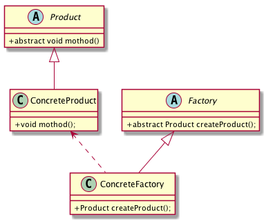

# 工厂方法模式 Factory Method Pattern

## 工厂方法模式的介绍

工厂模式属于创建性模式，应用的非常广泛，提供了一种非常好的创建对象方式。

## 工厂方法的定义：

   Define an interface for creating an object , but let subclassess decide which class to instantiate.Factory Method lets a class defer instantiation to subclassess .定义一个用于创建对象的接口，让子类决定实例化哪一个类。工厂方法使一个类的实例化延迟到其子类。
   
## 工厂方法模式的类图 


## 工厂模式代码示例


```
 /**
* 抽象产品
*/
public abstract class Product{
   public abstract void method();
}

/**
* 具体产品
*/
public class ConcreteProduct extends Product{
   @Override
   public void method() {
       System.out.println(getClass().getSimpleName()+".method");
   }
}

/**
* 抽象工厂
*/
public abstract class Factory{
   /**
    * 创建工厂
    * @return
    */
   public abstract Product createProduct();
}

/**
* 具体工厂
*/
public class ConcreteFactory extends Factory{
   @Override
   public Product createProduct() {
       return new ConcreteProduct();
   }
}
    
public static void main(String args[]){
   Factory factory = new ConcreteFactory();
   Product product = factory.createProduct();
   product.method();
}
```
## 工厂方法的角色

* Factory:抽象工厂为工厂方法模式的核心，也可以用接口定义。定义一个工厂方法返回创建的产品。
* ConcreteFactory:具体的工厂，创建具体的产品，当要生成多个产品时，我们可以定义多个具体工厂。
* Product:抽象的产品类，也可以用接口实现。
* ConcreteProduct:具体的产品

## 简单工厂模式

如果不适用抽象工厂，使用一个工厂类来创建不同的产品，这个就成为简单工厂模式。


```
  /**
* 抽象产品
*/
public abstract class Product{
   public abstract void method();
}

/**
* 具体产品
*/
public class ConcreteProductA extends Product{
   @Override
   public void method() {
       System.out.println(getClass().getSimpleName()+".method");
   }
}

/**
* 具体产品
*/
public class ConcreteProductB extends Product{
   @Override
   public void method() {
       System.out.println(getClass().getSimpleName()+".method");
   }
}


/**
* 具体工厂
*/
public class ConcreteFactory {

   public Product createProduct(String name) {
       if ("A".equals(name)){
           return new ConcreteProductA();
       }else if ("B".equals(name)){
           return new ConcreteProductB();
       }
       return null;
   }
}


public void test(){
 
}


public static void main(String args[]){
   ConcreteFactory factory = new ConcreteFactory();
   Product productA = factory.createProduct("A");
   productA.method();
   Product productB = factory.createProduct("B");
   productB.method();    
 }
```

## 多工厂模式

当生产多个产品时创建多个具体的工厂类，每个工厂类生产不同的产品，这个就是多工厂模式，实例如下：

```
 /**
* 抽象产品
*/
public abstract class Product{
   public abstract void method();
}

/**
* 具体产品
*/
public class ConcreteProductA extends Product{
   @Override
   public void method() {
       System.out.println(getClass().getSimpleName()+".method");
   }
}

/**
* 具体产品
*/
public class ConcreteProductB extends Product {
   @Override
   public void method() {
       System.out.println(getClass().getSimpleName()+".method");
   }
}

/**
* 抽象工厂
*/
public abstract class Factory{
   /**
    * 创建工厂
    * @return
    */
   public abstract Product createProduct();
}

/**
* 具体工厂
*/
public class ConcreteFactoryA extends Factory{
   @Override
   public Product createProduct() {
       return new ConcreteProductA();
   }
}

/**
* 具体工厂
*/
public class ConcreteFactoryB extends Factory{
   @Override
   public Product createProduct() {
       return new ConcreteProductB();
   }
}


public void test(){
   Factory factory = new ConcreteFactoryA();
   Product productA = factory.createProduct();
   productA.method();

   Factory factoryB = new ConcreteFactoryB();
   Product productB = factoryB.createProduct();
   productB.method();
}


public static void main(String args[]){
   Factory factory = new ConcreteFactoryA();
   Product productA = factory.createProduct();
   productA.method();

   Factory factoryB = new ConcreteFactoryB();
   Product productB = factoryB.createProduct();
   productB.method();
}
```

## 工厂方法的优点

   工厂模式扩展性非常的好，屏蔽了产品类，是典型的解藕框架，符合迪米特法则，也符合依赖倒置原则，也符合里氏替换原则。
   
## 工厂方法使用场景

   当需要灵活和可扩展的框架时可以考虑采用工厂方法模式。
   
   
## 参考

* 《设计模式之禅》
* 《Android源码设计模式解析实战》
   

