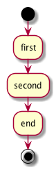

# 单例模式

## 单例模式的定义

确定某类只有一个实例，而且自行实例化并向整个系统提供这个实例。

## 单例模式类图



## 一个单例模式的例子 

```
public class Singleton {
    //自行生成一个类的实例。
    private static Singleton mInstance;

    //私有化构造方法。
    private Singleton(){}

    //提供获取一个类的实例的接口
    public static Singleton getInstance(){
        if (mInstance == null){
            mInstance = new Singleton();
        }
        return mInstance;
    }

    public static void main(String[] args){
        Singleton obj1 = Singleton.getInstance();
        Singleton obj2 = Singleton.getInstance();
        if (obj1 == obj2){
            System.out.println("obj1 和 obj2 对象相同");
        }else{
            System.out.println("obj1 和 obj2 对象不同");
        }
    }
}
```

在这个例子中定义了一个单例类Singleton，通过其静态公开方法getInstance()获取其实例。
然后在main方法中测试验证`Singleton.getInstance()`获取到的实例是否相同。

Singleton类有一个特点就是其构造函数是private，这就能够保证我们不能直接通过 `new Singleton()`生成Singleton类的实例。

## 单例模式的其他实现方式

### 懒汉模式-线程安全

示例中Singleton类，如果是在单线程环境下是能够正常工作的，如果在高并发的环境下，有可能出现问题。在多个线程同时调用`Singleton.getInstance()`生成单例的时候，有可能对生成多个单例。
这种情况下，我们可以利用线程的同步机制来保证只能生成一个单例,因为类的实例是在第一次使用的时候才初始化，所以称为懒汉模式。


```
public class Singleton {
    //自行生成一个类的实例。
    private volatile static Singleton mInstance;

    //私有化构造方法。
    private Singleton(){}

    //提供获取一个类的实例的接口
    public synchronized static Singleton getInstance(){
        if (mInstance == null){
            mInstance = new Singleton();
        }
        return mInstance;
    }
 }


``` 

懒汉模式能够保证在多线程环境下生成唯一的实例，第一次使用的时候才初始化，但是每次调用 `Singleton.getInstance()`都进行同步，造成了不必要的同步开销。


### DCL(Double Check Lock)

上面的懒汉式线程安全模式创建的单例，每次调用单例的时候，都会使用同步锁机制效率很差。
所有就有了这个双重检查机制。当单例为空的时候，才会使用同步锁机制创建单例。

```
public class Singleton {
//自行生成一个类的实例。
private volatile static Singleton mInstance;

//私有化构造方法。
private Singleton(){}

//提供获取一个类的实例的接口
public static Singleton getInstance(){
    if (mInstance == null){
        synchronized (Singleton.class){
            mInstance = new Singleton();
        }
    }
    return mInstance;
}
}
```


### 饿汉模式

当Singleton类加载的时候，静态变量mInstance便会创建。

```
public class Singleton {
    //自行生成一个类的实例。
    private static final Singleton mInstance = new Singleton();

    //私有化构造方法。
    private Singleton(){}

    //提供获取一个类的实例的接口
    public static SingletongetInstance(){
        return mInstance;
    }
}

```
其优点就是实现比较简单，但是一般不推荐是使用，因为如果这个单例类构造方法复杂，可能会导致类加载比较慢，此外类加载后，创建单例后，有可能没有立即调用，浪费资源。


### 静态内部类单例模式


```
public class Singleton {
    //私有化构造方法。
    private Singleton(){}

    //提供获取一个类的实例的接口
    public static Singleton getInstance(){
        return SingletonHolder.mInstance;
    }

    //静态内部类
    private static class SingletonHolder{
        //创建单例对象
        private static final Singleton mInstance = new Singleton();
    }
}

```

静态内部类的方法实现枚举，是《EffectiveJava》推荐的，比较常用。
它使用JVM本身的机制来保证线程安全问题。由于SingletonHolder是私有，外部无法访问，所以是懒汉式，当第一次进入Singleton.getInstance()方法时，SingletonHolder才被加载创建Singleton对象。

### 枚举单类


```

public enum Singleton {
    INSTANCE;

    public void doSomething(){
        System.out.println("doSomething");
    }
}
```

通过枚举实现单例是线程安全，防止反序列化。

## 单例模式的优缺点

### 优点

   因为只生成一个实例所有可以减少的内存的开销，减少对资源的多重占用，可以在常驻内存中，实现全局的资源访问。

### 缺点

单例类一般没有接口，扩展起来比较困难

## 单例模式的使用场景

 1. 含有大量的静态方法的工具类。
 2. 如果一个类操作文件和数据库等消耗内存的资源可以考虑使用单例模式。
 3. 需要一个公共的访问资源的时候，比如计数器等等。


